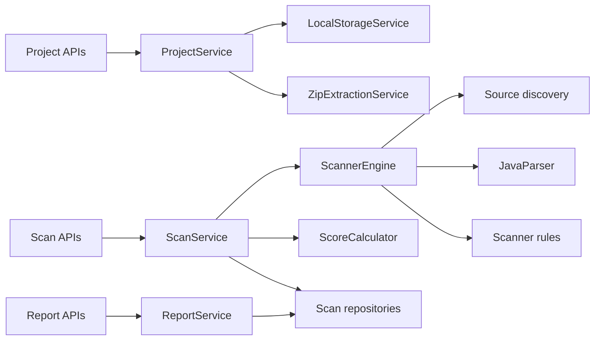

# Aperture

Architecture intelligence for Java and Spring Boot systems.

Aperture is a Spring Boot backend platform that scans uploaded Java/Spring Boot projects and reports architecture, Spring, persistence, security, maintainability, and testing risks. It is built as a professional middle-level backend portfolio project: not just CRUD, but file upload, safe ZIP extraction, Java source parsing, rule execution, scoring, scan history, and report APIs.

## What Aperture Detects

- Controllers depending directly on repositories
- Repositories used outside the service layer
- JPA entities returned from REST controllers
- Field injection with `@Autowired`
- `@Transactional` used in controllers
- Request bodies missing `@Valid` or `@Validated`
- List endpoints without pagination
- JPA relationships using `FetchType.EAGER`
- JPA relationships using `CascadeType.ALL`
- Hardcoded secrets in configuration files
- Hardcoded URLs in Java source
- Request DTO fields without validation annotations
- Empty catch blocks
- Large classes and large methods
- Service write methods missing `@Transactional`

## Tech Stack

- Java 21
- Spring Boot 3.5
- Gradle Kotlin DSL
- Spring Web, Validation, Security, Actuator
- Spring Data JPA
- PostgreSQL
- Flyway
- JavaParser
- Springdoc OpenAPI / Swagger
- JUnit 5

## Local Setup

Start PostgreSQL:

```powershell
docker compose up -d
```

Run tests:

```powershell
.\gradlew.bat test
```

Start the application:

```powershell
.\gradlew.bat bootRun
```

Open Swagger:

```text
http://localhost:8080/swagger-ui/index.html
```

Default database settings are in `src/main/resources/application.yaml` and can be overridden with `DB_URL`, `DB_USERNAME`, `DB_PASSWORD`, and `APERTURE_STORAGE_ROOT`.

Rule execution and quality gate thresholds can be configured in YAML:

```yaml
aperture:
  rules:
    disabled:
      - SPRING_REQUEST_DTO_FIELD_WITHOUT_VALIDATION
    severity-overrides:
      SECURITY_HARDCODED_URL: MEDIUM
  quality-gate:
    minimum-score: 80
    max-critical-issues: 0
    max-high-issues: 5
```

## Main API Flow

Create a project:

```http
POST /api/v1/projects
```

Upload a ZIP:

```http
POST /api/v1/projects/{projectId}/upload
```

Run a synchronous scan:

```http
POST /api/v1/projects/{projectId}/scan
```

Or start an async scan job:

```http
POST /api/v1/projects/{projectId}/scan-jobs
GET  /api/v1/scan-jobs/{scanJobId}
```

Evaluate a quality gate:

```http
GET /api/v1/scan-results/{scanResultId}/quality-gate
```

List and filter scan issues:

```http
GET /api/v1/scan-results/{scanResultId}/issues
GET /api/v1/scan-results/{scanResultId}/issues?severity=HIGH&category=SECURITY&ruleCode=SECURITY_HARDCODED_SECRET
```

Get JSON reports:

```http
GET /api/v1/scan-results/{scanResultId}/report/json
GET /api/v1/projects/{projectId}/report/json
```

Get Markdown reports:

```http
GET /api/v1/scan-results/{scanResultId}/report/markdown
```

Compare two scan results:

```http
GET /api/v1/scan-results/compare?from={oldScanResultId}&to={newScanResultId}
```

List supported rules:

```http
GET /api/v1/rules
```

Package the bundled demo ZIP:

```http
POST /api/v1/projects/samples/vulnerable-spring/package
```

Get project statistics:

```http
GET /api/v1/projects/{projectId}/stats
```

Clean old scan history:

```http
DELETE /api/v1/projects/{projectId}/scan-results?keepLast=5
```

## Report Shape

Reports include project metadata, score summary, grouped issue counts by category/severity/rule, and a detailed issue list with file path, line number, explanation, and recommendation.

Example issue:

```json
{
  "category": "ARCHITECTURE",
  "severity": "HIGH",
  "ruleCode": "ARCH_CONTROLLER_REPOSITORY_DEPENDENCY",
  "title": "Controller directly depends on Repository",
  "description": "UserController directly depends on UserRepository.",
  "recommendation": "Move repository access into a service class and inject the service into the controller.",
  "filePath": "src/main/java/com/example/UserController.java",
  "lineNumber": 14
}
```

## Demo Project

A deliberately flawed sample project is included under:

```text
samples/vulnerable-spring
```

Create a ZIP for upload:

```powershell
Compress-Archive -Path .\samples\vulnerable-spring\src -DestinationPath .\build\tmp\vulnerable-spring.zip
```

Then upload and scan that ZIP through Swagger.

## Architecture



## Roadmap

- GitHub repository import
- CI/CD quality gate mode
- PDF reports
- WebSocket scan progress
- Authentication and team workspaces
- Custom rule configuration
- Frontend dashboard
